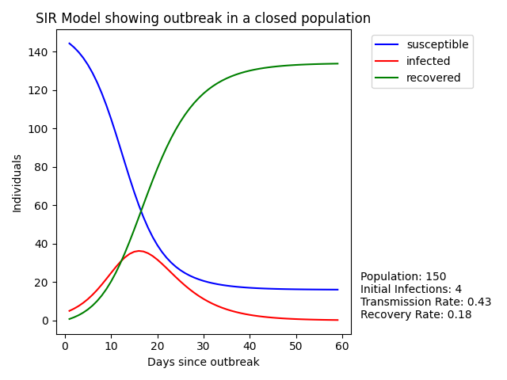

<div id="top"></div>

<br />
<div align="center">

[](https://circleci.com/gh/Sudoblark/sir_model_calculator/tree/main)
[](https://codecov.io/gh/Sudoblark/SIR_Model_Calculator)
[](https://hub.docker.com/r/sudoblark/sir-model-calculator)

<h3 align="center">SIR Model Calculator</h3>

  <p align="center">
    Program to model an epidemic outbreak, using a basic SIR Model, then visualise in matplotlib
    <br />
    <a href="https://github.com/Sudoblark/sir_model_calculator"><strong>Explore the docs »</strong></a>
    <br />
    <br />
    <a href="https://github.com/Sudoblark/sir_model_calculator/issues">Report Bug</a>
    ·
    <a href="https://github.com/Sudoblark/sir_model_calculator/issues">Request Feature</a>
  </p>
</div>


<!-- TABLE OF CONTENTS -->
<details>
  <summary>Table of Contents</summary>
  <ol>
    <li>
      <a href="#about-the-project">About The Project</a>
      <ul>
        <li><a href="#built-with">Built With</a></li>
      </ul>
    </li>
    <li>
      <a href="#getting-started">Getting Started</a>
      <ul>
        <li><a href="#prerequisites">Prerequisites</a></li>
        <li><a href="#installation">Installation</a></li>
        <ul>
          <li>
            <a href="#tests">Tests</a>
            <ul>
              <li><a href="#unit-tests">Unit Tests</a></li>
              <li><a href="#linter">Linter</a></li>
            </ul>
          </li>
        </ul>
      </ul>
    </li>
    <li><a href="#usage">Usage</a></li>
    <li><a href="#contributing">Contributing</a></li>
    <li><a href="#releases">Releases</a></li>
    <li><a href="#license">License</a></li>
    <li><a href="#contact">Contact</a></li>
  </ol>
</details>


<!-- ABOUT THE PROJECT -->
## About The Project

This project aims to use the [SIR Model](https://en.wikipedia.org/wiki/Compartmental_models_in_epidemiology) to simulate
an epidemic outbreak in a closed population. This was originally a coursework question for my [Degree](https://www.open.ac.uk/courses/computing-it/degrees/bsc-computing-it-software-q62-soft)
which I found particularly intriguing, so I figured I'd redo my answer in Python and add some nifty data visualisation to boot.

Note that instructions in the readme are for setting up a local development environment, whereas releases will contain 
instructions on how to utilise outside of a local development environment.

<p align="right">(<a href="#top">back to top</a>)</p>


### Built With
* [matplotlib](https://matplotlib.org/)

<p align="right">(<a href="#top">back to top</a>)</p>


<!-- GETTING STARTED -->
## Getting Started

The steps below detail how to get a local version up the program up and running.

### Prerequisites

* Windows
  * [Python 3](https://www.python.org/downloads/windows/)
* Linux
  * [Python 3](https://docs.python-guide.org/starting/install3/linux/)

### Installation

* Windows
    * Clone repo and cd into repo
    ```bash
    git clone https://github.com/Sudoblark/SIR_Model_Animation.git
    cd SIR_Model_Animation
    ```
    * Setup Python venv and activate
    ```bash
    python3 -m venv venv
    venv\Scripts\activate
    ```
    * Install dependencies
    ```bash
    pip3 install -r requirements
    ```

* Linux
    * Clone repo and cd into repo
    ```bash
    git clone https://github.com/Sudoblark/SIR_Model_Animation.git
    cd SIR_Model_Animation
    ```
    * Setup Python venv
    ```bash
    python3 -m venv venv
    source venv/bin/activate
    ```
    * Install dependencies
    ```bash
    pip3 install -r requirements.txt
    ```

<p align="right">(<a href="#top">back to top</a>)</p>

<!-- TESTS -->
### Tests
#### Unit Tests
Unit tests are run on every commit, but you can do them yourself if working locally by following the below instructions.

* Setup a venv as per installation instructions
* Install the following packages:
```
pip install pytest
```
* Run pytest with Python executor to implicitly add current path to PYTHONPATH
```
python -m pytest
```

<p align="right">(<a href="#top">back to top</a>)</p>

#### Linter
PyLint is run on every commit, but you can run it yoruself if working locally by following the below instructions.
* Setup a venv as per installation instructions
* Install the following packages:
```
pip install pylint
pip install pylint_gitlab
```

* Run PyLint with HTML output
```
pylint src --exit-zero --load-plugins=pylint_gitlab --output-format=gitlab-pages-html --output=index.html
```

<!-- USAGE EXAMPLES -->
## Usage

Now your virtual environment is setup, change to the src directory and run help to determine what options are available:

```
(venv) C:\temp\sir_model_calculator\src>python -m main -h
```

For example, running the below will output a line graph showing SIR data:

```
(venv) C:\temp\SIR_Model_Animation\src>python -m main matplotlib 150 4 60 0.43 0.18
```



<p align="right">(<a href="#top">back to top</a>)</p>

<!-- CI -->
## CI

CircleCI is used to run unit tests, generate code coverage reports, run pylint and both build and push docker images to dockerhub.

This follows a rather standard workflow of:
- Commits not on main cause CI to kick in, and to push docker images with a tag of `dev`
- Commits on main (i.e. an approved PR that is merged) causes CI to ckick in, but pushes docker images with a tag of `qa` rather than `dev`
- Marking a release in Github triggers CI, but pushes docker images with the following tags:
  - `latest`
  - `VERSION` corresponding to the release, e.g. `0.1.0`


### Setup

- Code coverage reports are uploaded to codecov, using `CODECOV_TOKEN` for the authorisation token 
- `DOCKER_USER` and `DOCKER_PASS` env vars are needed for dockerhub authorisation

<!-- CONTRIBUTING -->
## Contributing

Contributions are what make the open source community such an amazing place to learn, inspire, and create. Any contributions you make are **greatly appreciated**.

If you have a suggestion that would make this better, please fork the repo and create a pull request. You can also simply open an issue with the tag "enhancement".
Don't forget to give the project a star! Thanks again!

1. Fork the Project
2. Create your Feature Branch (`git checkout -b feature/AmazingFeature`)
3. Commit your Changes (`git commit -m 'Add some AmazingFeature'`)
4. Push to the Branch (`git push origin feature/AmazingFeature`)
5. Open a Pull Request

<p align="right">(<a href="#top">back to top</a>)</p>

<!-- Releases -->
## Releases
Releases are both distributed as source code and a docker image.

### Docker
Images are pushed to [dockerhub](https://hub.docker.com/repository/docker/sudoblark/sir-model-calculator) via circleCI.

Both dockerfile and README.md for dockerhub are inside the `docker` folder

#### Manually building and pushing
To manually build and push run the following commands:

```
docker build -f .\docker\dockerfile . -t sudoblark/sir-model-calculator:tagname
# Done so we also push the readme.md
cd docker 
docker push sudoblark/sir-model-calculator:tagname
```

### Source Code
TODO

<p align="right">(<a href="#top">back to top</a>)</p>

<!-- LICENSE -->
## License

Distributed under the GNU General Public License. See `LICENSE.txt` for more information.

<p align="right">(<a href="#top">back to top</a>)</p>


<!-- CONTACT -->
## Contact

Sudoblark - [@linkedin_handle](https://www.linkedin.com/in/benni/)

Project Link: [sir_model_calculator](https://github.com/Sudoblark/sir_model_calculator)

<p align="right">(<a href="#top">back to top</a>)</p>
